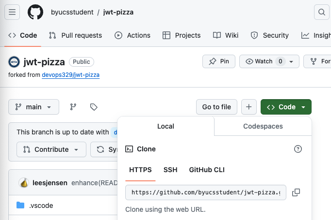
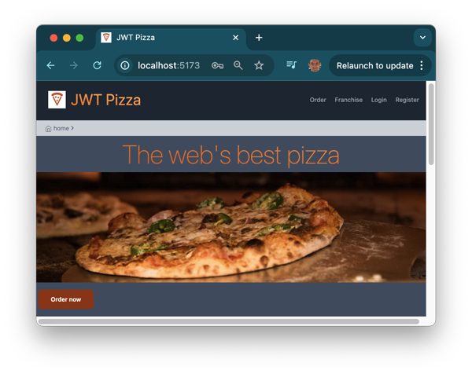
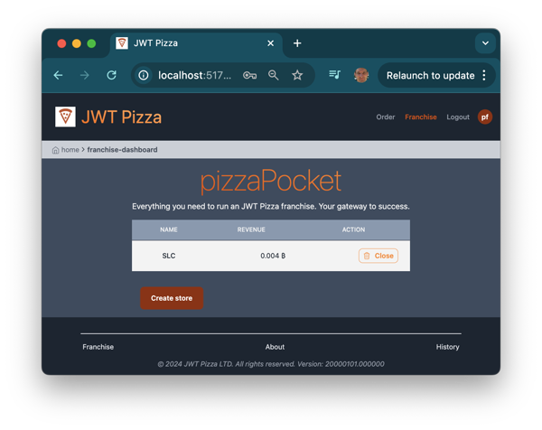

# JWT Pizza Client

🔑 **Key points**

- You need to fork the [jwt-pizza](https://github.com/devops329/jwt-pizza) repository.
- Become intimately familiar with the JWT Pizza frontend code.
- Many projects revolve around your manipulating this project.

---


The _JWT Pizza application_ team has finally finished their work on the website and has given you access to the frontend application code so that you can start testing and deploying it.

Now that you have the frontend application you can run the full JWT Pizza stack in your development environment. This includes the frontend (_jwt-pizza_), backend (_jwt-pizza-service_), and the database. The only piece that you do not actually manage is the service provided by JWT Headquarters that creates the JWT tokens representing a completed pizza order. Instead, your deployment of the JWT service will simply call the factory service that the JWT Headquarters provides.

```mermaid
graph LR;
    subgraph  Development environment
    jwtPizza-->jwtPizzaService
    jwtPizzaService-->database
    end
    subgraph JWT Headquarters
    jwtPizzaService-->jwtPizzaFactory
    end
```

Later in the course you will deploy the full JWT Pizza stack to a production environment using AWS.

## Forking the application team's repository

To get started you need to fork the code to your GitHub account, run it locally and study how it works. This will get you comfortable with the code so that you are ready to start putting on your QA and DevOps hat.

Here are the steps to take:

1. Navigate your browser over to the [jwt-pizza](https://github.com/devops329/jwt-pizza) repository on GitHub and select the option to `Fork` the repository.
   > 
1. Create the fork by pressing the `Create fork` button. For the AutoGrader to find your repo, leave the name of the repository `jwt-pizza`.
   > 
1. Invite 329 TA to be a collaborator on your repository by navigating to `Settings -> Collaborators -> Add People` and searching for `byucs329ta`.

   

   > [!IMPORTANT]
   >
   > If you do not invite the TA to be a collaborator you will not be able to pass off your deliverables.

1. Copy the URL for your fork of the repository.
   > 
1. Use the URL to clone the repository from your account to your development environment.
   ```sh
   git clone https://github.com/youraccountnamehere/jwt-pizza.git
   ```

## Running the frontend in your development environment

1. Change directory into the newly clone repository and install the NPM package dependencies.
   ```sh
   cd jwt-pizza
   npm install
   ```
1. Launch the frontend code in development mode using NPM. Press `o ⏎` to open your browser.
   ```sh
   npm run dev
   ```

## Keep in sync

As the application team makes changes to the frontend code you will need to sync your fork of the repository. As long as you are only adding tests and not changing the core code, you shouldn't have to merge any code.

To sync your fork, navigate to your account's fork of the `jwt-pizza` repository. It will display if your fork is out of date. Press the `Sync fork` button and confirm the action.

> [!NOTE]
>
> Do not press the `Discard commits` button if it is available, or you will lose any code that you have added to your fork such as tests you have written.


You will then need to pull the changes down to your development environment.

```sh
cd jwt-pizza
git pull
```

## JWT Pizza architecture

The following is the sitemap for JWT Pizza as provided by the application team. Note that while JWT Pizza is a fairly simple website, it has a significant amount of components and views that will require testing.

```mermaid
graph TB;
    Home-->Login
    Home-->Logout
    Home-->Register
    Home-->History
    Home-->About
    Home-->Menu
    Home-->AdminDashboard
    Home-->FranchiseDashboard
    Register<-->Login
    AdminDashboard-->CreateFranchise
    AdminDashboard-->CloseFranchise
    AdminDashboard-->CloseStore
    FranchiseDashboard-->CreateStore
    FranchiseDashboard-->CloseStore
    Home-->DinnerDashboard
    DinnerDashboard-->Menu
    Menu-->Payment
    Payment-->Login
    Payment-->Delivery
    Delivery-->Verify
    Delivery-->Menu
```

Make sure you spend reasonable time both playing with the interface and also exploring the code. This will be a key factor in your success for both testing and deploying the application.

## ☑ Exercise

Following the above instruction you should have already forked and cloned the jwt-pizza repository to your development environment. Your copy of the JWT Pizza repo URL should look something like this:

```
https://github.com/youraccountnamehere/jwt-pizza
```

Now you can build and start up the JWT pizza frontend in your development environment and learn the code.

1. Build and explore the application code.
   ```sh
   cd jwt-pizza
   npm install
   ```
1. Start up the JWT Pizza backend by following the [JTW Pizza Service](../jwtPizzaService/) instruction.
1. Start up the JWT Pizza frontend by running `npm run dev`. You should be able to access the application in your browser using the URL `localhost:5173`.



Open the browser's dev tools, set breakpoints and begin learning the code. Make sure you do at least the following:

1.  Login as the default admin (a@jwt.com with password `admin`)
1.  Order a pizza.
1.  Validate that the pizza JWT is valid.
1.  Login as a franchisee (f@jwt.com with password `franchisee`)
1.  View the franchisee menu and observe that you have received the revenue for the pervious pizza purchase.


